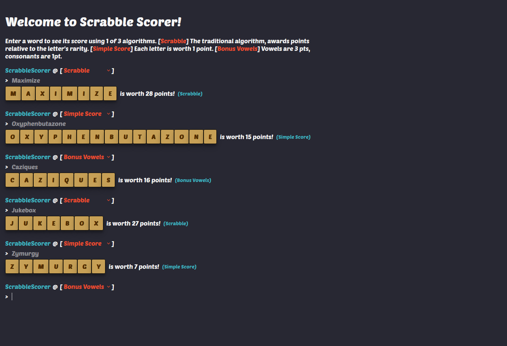
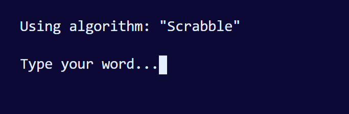
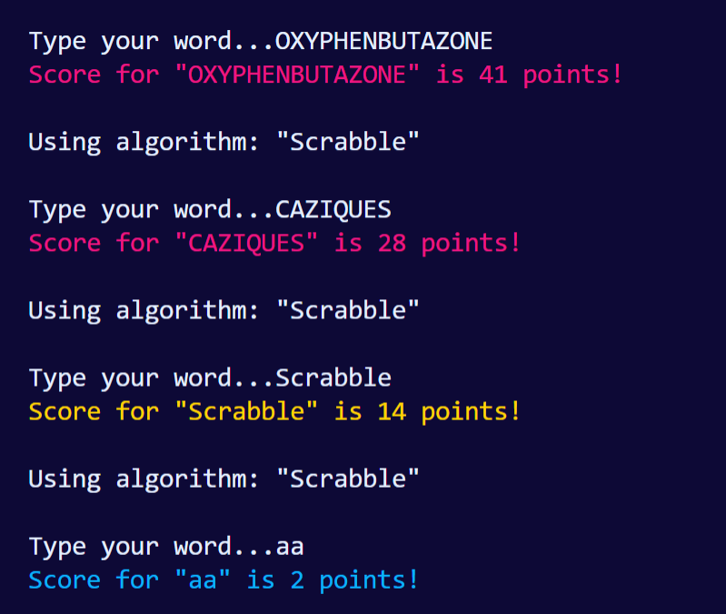
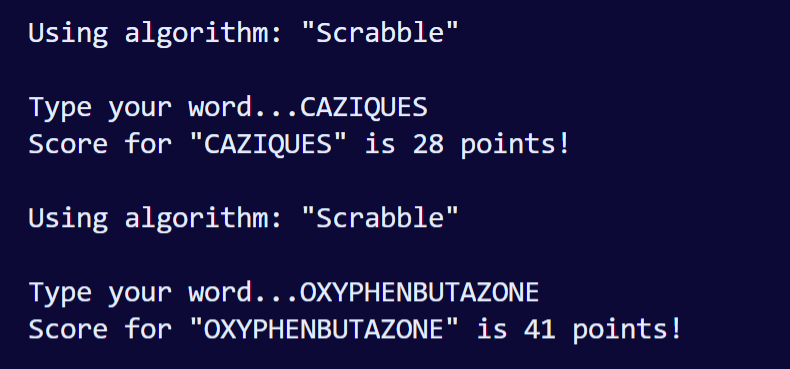

# Scrabble Scorer

A program that accepts user input in the form of a word and returns a Scrabble score relative to one of three scoring algorithms.

- The first algorithm, "Scrabble" awards points relative to the letter's rarity.
- The second algorithm, "Simple Score" awards one point for every letter.
- The third algorithm, "Bonus Vowels" awards three points for vowels, one point for consonants.

Each submission must be recognized as a valid English word to be awarded points. Submissions are case insensitive.

_This program was a homework assignment at LaunchCode's Lc101 (2019)_



## Table of Contents

- [Technologies Used](#technologies-used)
- [How to run locally](#how-to-run-locally)
  - [Via web app](#via-web-app)
    - [With Docker](#with-docker)
    - [With Node](#with-node)
  - [Via command line](#via-command-line)
- [Screenshots](#screenshots)
  - [Desktop](#desktop)
  - [Mobile](#mobile)
  - [Command line interface](#command-line-interface)

## Technologies Used

- TypeScript
- JavaScript
- React
- Node
- Express
- HTML
- CSS
- axios
- check-word
- react-toastify
- vite
- Docker

## How to run locally

**The steps below assume you have `git`, `Node`, and/or `Docker` installed on your machine. It is also assumed that you are executing commands from the root of this repository on your local machine.**

### Via web app

#### With Docker

Note: Confirm that Docker is running prior to proceeding and that port `8080` is not being used by another program.

1. Clone this repository.
2. cd into `docker` directory

```
cd docker/
```

3. Build docker image and start container

```
docker compose up --build
```

4. Visit http://localhost:8080

#### With Node

1. Clone this repository.
2. Install necessary dependencies via `npm` for `back-end` and `front-end`

```
cd back-end/ && npm i && cd ../front-end && npm i && cd ..
```

3. Build server and UI (must be in that order)

```
cd back-end/ && npm run build && cd ../front-end && npm run build && cd ..
```

4. Run server

```
cd back-end/ && node dist/server.js
```

5. Visit webpage @ http://localhost:8080/

### Via command line

**Note: requires Node**

1. Clone this repository.
2. `cd` into `cli/` directory

```
cd cli/
```

3. Start command line program

```
npm run start
```

# Screenshots

## Desktop

## Mobile

## Command line interface

### Menu


### Scrabble (Algo 1)




### Simple Score (Algo 2)



### Bonus Vowels (Algo 3)


